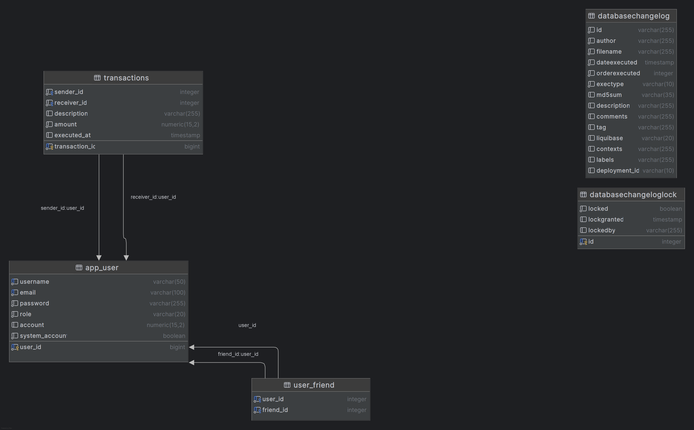

# Pay My Buddy - Documentation
## Description
"Pay My Buddy" is a peer-to-peer payment management application.

It allows users to:
- Sign up and log in,
- Add friends,
- Send and receive money,
- View their transaction history.

## Technologies Used
- **Java 21**
- **Spring Boot 3.4** (REST API backend)
- **Thymeleaf** (server-side rendering - Frontend version 1)
- **PostgresSQL** (database)
- **Jackson** (data serialization)
- **Maven** (project management)
- **Log4j 2** (logging)
- **Swagger 2.2** (API documentation)
- **JUnit**, **JaCoCo 0.8**, **Mockito 5.13** (testing)

## Main Endpoints

### Authentication
- `POST /auth/login` → User login
- `POST /auth/register` → User registration

### Friends
- `POST /users/me/friends/v0?friendEmail=email` → Add a friend
- `GET /users/me/friends` → Retrieve friend list

### Transactions
- `POST /transactions` → Send money
- `GET /transactions` → Get transaction history

## Physical Data Model (PDM)
The project uses **PostgresSQL**.  
The following schema represents the physical structure of the database used in this project:

### Description
- The tables `app_users`, `user_friend`, and `transactions` are used to manage users and their relationships.
- Foreign keys enforce referential integrity.
- The model is designed to avoid redundancy and optimize joins.

## Database Migrations
- **Liquibase** is used to manage database migrations and versioning for PostgresSQL.
- Migration scripts are located in `src/main/resources/db/changelog`.

## Error Handling
The API uses standard HTTP status codes to indicate the result of an API request.
Some common responses:

-200 OK: The request was successful

-400 Bad Request: The request is malformed or missing parameters  

-404 Not Found: The resource could not be found  

-500 Internal Server Error: A server-side error occurred

## Logging
The application uses Log4j for logging. Log levels are defined as follows:  
-INFO: Successful requests and responses  
-ERROR: Errors or exceptions during processing  
-DEBUG: Informative logs for troubleshooting  
Logs are stored in the console and can also be configured to be written to files.

## Installation
To run this project locally, ensure you have the following installed:
- **Java 17 or later**
- **Maven 3.9.6**
- **PostgresSQL** (configured database instance, e.g., via **pgAdmin**)
  
Clone the repository : git clone https://github.com/Lulippe-Hiboude/payMyBuddy.git
